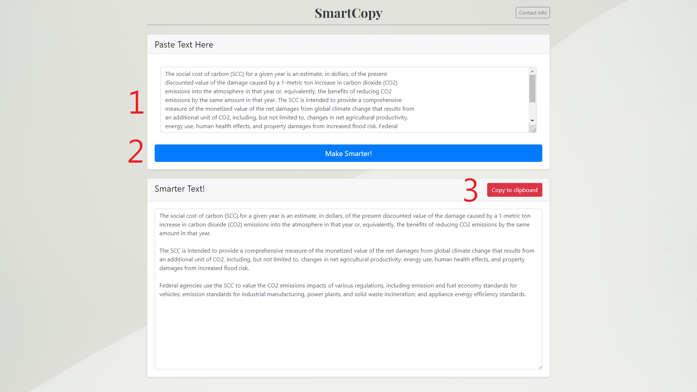

# smart-copy-from-en-pdf

## About This Project 🚀👑 🎈

**Do you ever have trouble with copying English article or thesis graphs without tidy format?** 
> **NO MORE ADJUSTING AND FORMATTING BY HAND!! 📢 **

### Only Need 3 steps here!

1. **paste** dirty-text.
2. **make smarter**.
3. **tidy-text** ready to use!

## Activation Information 🚩

1. **Create** Virtual Environment (Needed First time)
    - `>> conda create -n smartcopy python=3.6.6`
      - (WITHOUT full anaconda pre-install packages)
2. **Activate** Virtual Environment (Everytime)
    - `>> activate smartcopy`
3. **Install** Packages Into Environment (Needed First Time, or some changes happened)
    - `>> (smartcopy) pip install -r requirements.txt`
4. **Run** this django server
    1. `>> (smartcopy) cd smartcopyweb`
    2. `>> (smartcopy) python manage.py runserver`
5. **Use** with broswer!
    - `http://localhost:8000/en/`
